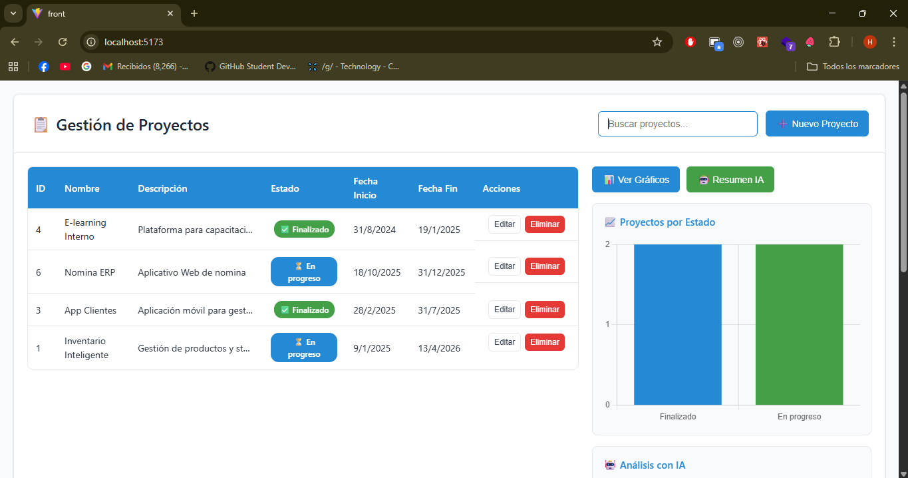
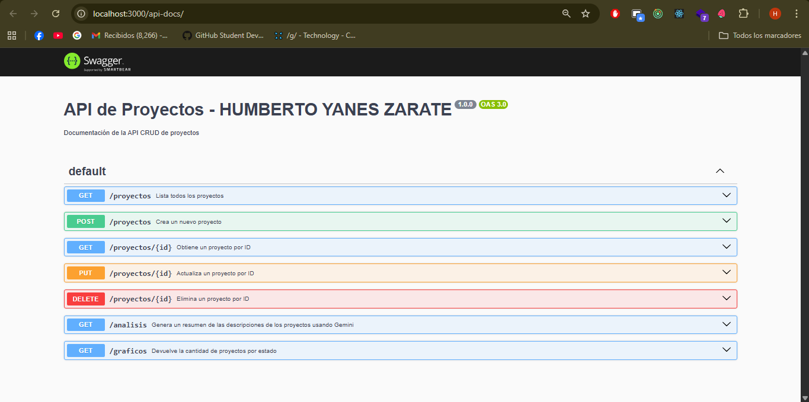
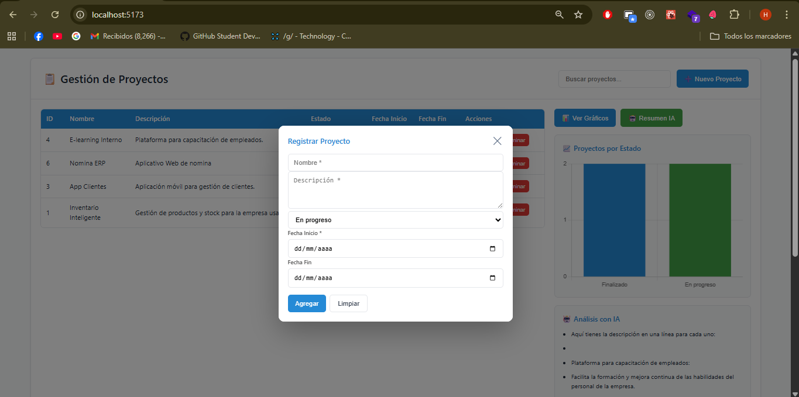
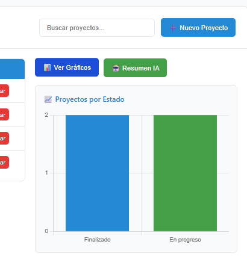
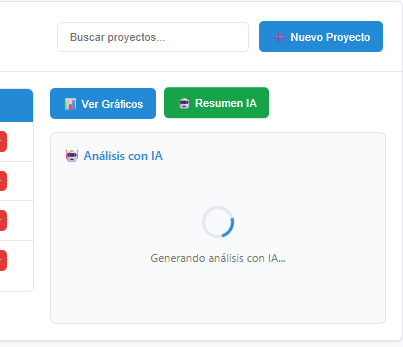
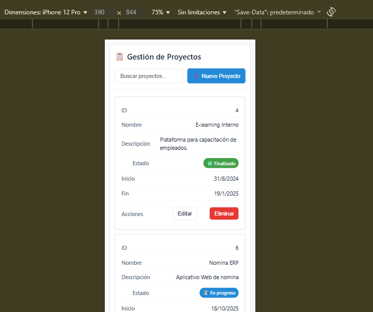
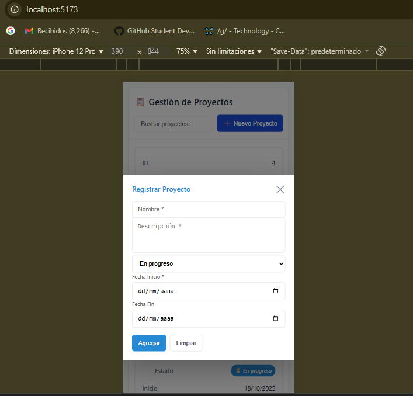
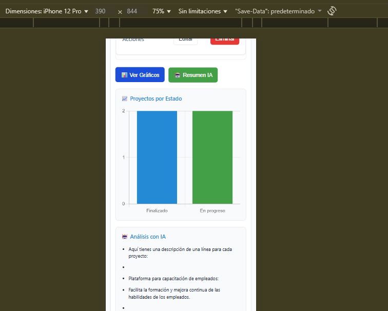

# 📋 Sistema de Gestión de Proyectos

Sistema fullstack para gestión de proyectos con análisis de IA generativa, desarrollado con Node.js, Express, PostgreSQL, React y Chart.js.

---

## 📑 Tabla de Contenidos

- [Características](#características)
- [Tecnologías](#tecnologías)
- [Arquitectura del Proyecto](#arquitectura-del-proyecto)
- [Requisitos Previos](#requisitos-previos)
- [Instalación](#instalación)
- [Configuración](#configuración)
- [Ejecución](#ejecución)
- [Documentación de la API](#documentación-de-la-api)
- [Ejemplos de Uso](#ejemplos-de-uso)
- [Capturas de Pantalla](#capturas-de-pantalla)
- [Decisiones Técnicas](#decisiones-técnicas)
- [Estructura del Proyecto](#estructura-del-proyecto)

---

## ✨ Características

- ✅ **CRUD completo** de proyectos (crear, leer, actualizar, eliminar)
- ✅ **Análisis con IA generativa** usando Google Gemini para resumir descripciones de proyectos
- ✅ **Gráficos interactivos** con Chart.js para visualizar distribución de proyectos por estado
- ✅ **Interfaz web responsiva** que funciona en desktop, tablet y móvil
- ✅ **Documentación de API** con Swagger UI
- ✅ **Base de datos PostgreSQL** con ORM Sequelize
- ✅ **Búsqueda en tiempo real** de proyectos
- ✅ **Modal interactivo** para crear/editar proyectos

---

## 🛠️ Tecnologías

**Nota:** Todas estas dependencias se instalan automáticamente al ejecutar `npm install` en cada carpeta (pasos 5 y 6 de la instalación).

### Backend
- **Node.js** v18+ (requiere instalación previa)
- **Express** v5.1.0 - Framework web
- **Sequelize** v6.37.7 - ORM para PostgreSQL
- **pg** - Driver de PostgreSQL para Node.js
- **Swagger** (swagger-jsdoc + swagger-ui-express) - Documentación de API
- **Google Gemini AI** (@google/genai) - IA generativa para análisis de texto
- **CORS** - Manejo de políticas de origen cruzado
- **dotenv** - Gestión de variables de entorno

### Frontend
- **React** v19.2.0 - Librería de UI
- **Vite** v7.1.10 - Build tool y dev server
- **Chart.js** v4.5.1 + react-chartjs-2 v5.3.0 - Gráficos interactivos
- **CSS3** - Estilos responsivos personalizados

### Infraestructura
- **PostgreSQL** v12+ (requiere instalación previa - ver [Requisitos Previos](#requisitos-previos))
- **npm** - Gestor de paquetes (viene con Node.js)

---

## 🏗️ Arquitectura del Proyecto

```
prueba-HYZ/
├── back/                    # Backend (Node.js + Express)
│   ├── src/
│   │   ├── controllers/     # Lógica de negocio
│   │   ├── models/          # Modelos de Sequelize
│   │   └── routes/          # Definición de rutas
│   ├── .env                 # Variables de entorno (DB + API Keys)
│   ├── config.js            # Configuración de base de datos
│   ├── db.js                # Conexión Sequelize
│   ├── index.js             # Punto de entrada del servidor
│   └── swagger.js           # Configuración de Swagger
│
├── front/                   # Frontend (React + Vite)
│   ├── src/
│   │   ├── components/      # Componentes React
│   │   ├── App.jsx          # Componente principal
│   │   └── main.jsx         # Punto de entrada
│   └── vite.config.js       # Configuración de Vite
│
└── README.md                # Este archivo
```

---

## 📋 Requisitos Previos

Antes de comenzar, asegúrate de tener instalado lo siguiente:

1. **Node.js** v18 o superior → [Descargar](https://nodejs.org/)
   - Verifica la instalación: `node --version`
   
2. **PostgreSQL** v12 o superior → [Descargar](https://www.postgresql.org/download/)
   - Verifica la instalación: `psql --version`
   
3. **npm** (viene con Node.js)
   - Verifica la instalación: `npm --version`
   
4. **Git** (para clonar el repositorio)
   - Verifica la instalación: `git --version`

5. **Cuenta de Google** para obtener API Key de Gemini (gratuita)
   - Regístrate en: [https://aistudio.google.com](https://aistudio.google.com)

---

## 🚀 Instalación y Configuración

Sigue estos pasos **en orden** para instalar y configurar el proyecto:

---

### PASO 1: Clonar el repositorio

```bash
git clone <URL_DEL_REPOSITORIO>
cd prueba-HYZ
```

---

### PASO 2: Configurar Base de Datos PostgreSQL

**Debes crear la base de datos ANTES de instalar las dependencias.**

#### Opción A: Usando línea de comandos (psql)

```bash
# 1. Conectar a PostgreSQL (reemplaza 'postgres' con tu usuario)
psql -U postgres

# 2. Crear la base de datos (usa el nombre que prefieras)
CREATE DATABASE proyecto;

# 3. Salir de psql
\q
```

**Opcional:** Si quieres crear un usuario específico:
```sql
CREATE USER mi_usuario WITH PASSWORD 'mi_contraseña';
GRANT ALL PRIVILEGES ON DATABASE proyecto TO mi_usuario;
```

#### Opción B: Usando pgAdmin (Interfaz Gráfica)

1. Abre pgAdmin
2. Conecta al servidor local
3. Click derecho en "Databases" → "Create" → "Database..."
4. **Nombre:** El que prefieras (ej: `proyecto`, `mis_proyectos`, etc.)
5. **Owner:** Tu usuario de PostgreSQL (ej: `postgres`)
6. Click en "Save"

**✅ Anota estos datos, los necesitarás en el siguiente paso:**
- Nombre de la base de datos
- Usuario de PostgreSQL
- Contraseña del usuario

---

### PASO 3: Configurar variables de entorno del Backend

1. **Navega a la carpeta del backend:**
   ```bash
   cd back
   ```

2. **Crea un archivo `.env` en la carpeta `back/`:**
   
   **En Windows (PowerShell):**
   ```powershell
   New-Item .env -ItemType File
   ```
   
   **En Linux/Mac:**
   ```bash
   touch .env
   ```

3. **Abre el archivo `.env` con tu editor de texto y agrega lo siguiente:**

   ```env
   DB_NAME=proyecto
   DB_USER=postgres
   DB_PASS=tu_contraseña_aqui
   DB_HOST=localhost
   DB_PORT=5432
   GEMINI_API_KEY=tu_api_key_aqui
   ```

4. **Reemplaza los valores con TUS credenciales:**

   - `DB_NAME`: El nombre de la base de datos que creaste en el PASO 2
   - `DB_USER`: Tu usuario de PostgreSQL (por defecto: `postgres`)
   - `DB_PASS`: La contraseña de tu usuario de PostgreSQL
   - `DB_HOST`: `localhost` (si PostgreSQL está en tu máquina)
   - `DB_PORT`: `5432` (puerto por defecto de PostgreSQL)
   - `GEMINI_API_KEY`: Tu API Key de Google Gemini (sigue el paso 4 para obtenerla)

---

### PASO 4: Obtener API Key de Google Gemini

1. Visita: [https://aistudio.google.com/app/apikey](https://aistudio.google.com/app/apikey)
2. Inicia sesión con tu cuenta de Google
3. Haz clic en **"Create API Key"** o **"Get API Key"**
4. Copia la clave generada
5. Pégala en el archivo `.env` en la variable `GEMINI_API_KEY`


### PASO 5: Instalar dependencias del Backend

**Asegúrate de estar en la carpeta `back/`:**

```bash
npm install
```

**✅ Esto instalará automáticamente todas las dependencias definidas en `package.json`:**
- `express` - Framework web
- `sequelize` - ORM para PostgreSQL
- `pg` y `pg-hstore` - Drivers de PostgreSQL
- `@google/genai` - Cliente de Google Gemini AI
- `swagger-jsdoc` - Generación de documentación Swagger
- `swagger-ui-express` - Interfaz gráfica de Swagger
- `cors` - Middleware para CORS
- `dotenv` - Carga de variables de entorno

**Espera hasta que veas:** `added XXX packages`

---

### PASO 6: Instalar dependencias del Frontend

```bash
cd ../front
npm install
```

**✅ Esto instalará automáticamente:**
- `react` y `react-dom` - Librería de UI
- `vite` - Build tool y dev server
- `chart.js` - Librería de gráficos
- `react-chartjs-2` - Integración de Chart.js con React

**Espera hasta que veas:** `added XXX packages`

---

## ▶️ Ejecución

Una vez completados todos los pasos de instalación:

### PASO 7: Iniciar el Backend

Abre una terminal y ejecuta:

```bash
cd back
npm start
```

**✅ Si todo está bien configurado, verás:**
```
Servidor corriendo en http://localhost:3000
Conexión exitosa a la base de datos
```

**Endpoints disponibles:**
- API REST: `http://localhost:3000/proyectos`
- Swagger UI: `http://localhost:3000/api-docs`

---

### PASO 8: Iniciar el Frontend

**Abre una NUEVA terminal** (deja la anterior corriendo) y ejecuta:

```bash
cd front
npm run dev
```

**✅ Verás algo como:**
```
VITE v7.1.10  ready in 500 ms
➜  Local:   http://localhost:5173/
➜  Network: use --host to expose
```

---

### PASO 9: Abrir la aplicación

Abre tu navegador y visita: **http://localhost:5173**

**¡Listo!** Ahora puedes:
- ✅ Ver la lista de proyectos
- ✅ Crear nuevos proyectos
- ✅ Editar/eliminar proyectos
- ✅ Ver gráficos de distribución
- ✅ Generar análisis con IA

---

## 📚 Documentación de la API

### Acceso a Swagger UI

Visita **http://localhost:3000/api-docs** para explorar y probar todos los endpoints de forma interactiva.

### Endpoints Principales

#### **CRUD de Proyectos**

| Método | Endpoint | Descripción |
|--------|----------|-------------|
| GET | `/proyectos` | Obtener todos los proyectos |
| GET | `/proyectos/:id` | Obtener un proyecto por ID |
| POST | `/proyectos` | Crear un nuevo proyecto |
| PUT | `/proyectos/:id` | Actualizar un proyecto |
| DELETE | `/proyectos/:id` | Eliminar un proyecto |

#### **Endpoints Adicionales**

| Método | Endpoint | Descripción |
|--------|----------|-------------|
| GET | `/analisis` | Generar resumen con IA de las descripciones de proyectos |
| GET | `/graficos` | Obtener cantidad de proyectos agrupados por estado |

---

## 📖 Ejemplos de Uso

### 1. Crear un proyecto

**Request:**
```bash
POST http://localhost:3000/proyectos
Content-Type: application/json

{
  "nombre": "Sistema ERP",
  "descripcion": "Desarrollo de sistema de planificación de recursos empresariales",
  "estado": "En progreso",
  "fechaInicio": "2025-01-15",
  "fechaFin": "2025-12-31"
}
```

**Response:**
```json
{
  "id": 1,
  "nombre": "Sistema ERP",
  "descripcion": "Desarrollo de sistema de planificación de recursos empresariales",
  "estado": "En progreso",
  "fechaInicio": "2025-01-15T00:00:00.000Z",
  "fechaFin": "2025-12-31T00:00:00.000Z",
  "createdAt": "2025-10-19T16:30:00.000Z",
  "updatedAt": "2025-10-19T16:30:00.000Z"
}
```

### 2. Listar todos los proyectos

**Request:**
```bash
GET http://localhost:3000/proyectos
```

**Response:**
```json
[
  {
    "id": 1,
    "nombre": "Sistema ERP",
    "descripcion": "Desarrollo de sistema de planificación de recursos empresariales",
    "estado": "En progreso",
    "fechaInicio": "2025-01-15T00:00:00.000Z",
    "fechaFin": "2025-12-31T00:00:00.000Z"
  },
  {
    "id": 2,
    "nombre": "App Móvil",
    "descripcion": "Aplicación móvil para gestión de clientes",
    "estado": "Finalizado",
    "fechaInicio": "2024-06-01T00:00:00.000Z",
    "fechaFin": "2024-12-20T00:00:00.000Z"
  }
]
```

### 3. Obtener análisis con IA

**Request:**
```bash
GET http://localhost:3000/analisis
```

**Response:**
```json
{
  "resumen": "* **Sistema ERP:** Permite planificar y gestionar recursos empresariales de forma centralizada...\n* **App Móvil:** Facilita la gestión de clientes desde dispositivos móviles..."
}
```

### 4. Obtener datos para gráficos

**Request:**
```bash
GET http://localhost:3000/graficos
```

**Response:**
```json
{
  "En progreso": 3,
  "Finalizado": 2,
  "Pendiente": 1
}
```

---

## 📸 Capturas de Pantalla

### Desktop

#### 1. Pantalla Principal - Lista de Proyectos
> **📷 TOMA CAPTURA:** Vista principal con la tabla de proyectos, botones de acción y sidebar con gráficos.



#### 2. Swagger UI - Documentación de API
> **📷 TOMA CAPTURA:** Accede a http://localhost:3000/api-docs y captura la interfaz de Swagger con todos los endpoints.



#### 3. Modal de Crear/Editar Proyecto
> **📷 TOMA CAPTURA:** Haz clic en "➕ Nuevo Proyecto" y captura el modal abierto con el formulario.



#### 4. Gráfico de Distribución de Proyectos
> **📷 TOMA CAPTURA:** Haz clic en "📊 Ver Gráficos" y captura el gráfico de barras mostrando proyectos por estado.



#### 5. Análisis con IA
> **📷 TOMA CAPTURA:** Haz clic en "🤖 Resumen IA" y captura el panel con el análisis generado por Gemini.



---

### Móvil / Responsive

#### 6. Vista Móvil - Lista de Proyectos (Tarjetas)
> **📷 TOMA CAPTURA:** Abre Chrome DevTools (F12), activa modo responsive (Ctrl+Shift+M), selecciona "iPhone 12 Pro" y captura la vista con proyectos en formato de tarjetas.



#### 7. Vista Móvil - Modal de Proyecto
> **📷 TOMA CAPTURA:** En modo móvil, abre el modal de nuevo proyecto y captura cómo se adapta a pantalla completa.



#### 8. Vista Móvil - Gráficos y Análisis IA
> **📷 TOMA CAPTURA:** En modo móvil, muestra los gráficos y el análisis IA apilados verticalmente.



---

## 🧠 Decisiones Técnicas

### Backend

**¿Por qué Node.js + Express?**
- Ecosistema maduro y ampliamente usado en la industria
- Excelente rendimiento para APIs REST
- Gran comunidad y recursos disponibles

**¿Por qué Sequelize?**
- ORM robusto con soporte completo para PostgreSQL
- Facilita migraciones y sincronización de modelos
- Abstracción que permite cambiar de base de datos fácilmente

**¿Por qué Swagger?**
- Documentación automática y visualmente clara
- Permite probar endpoints sin herramientas externas
- Estándar de la industria para APIs REST

**¿Por qué Google Gemini?**
- API gratuita con límites generosos
- Modelo de IA de última generación
- Fácil integración con Node.js

### Frontend

**¿Por qué React?**
- Librería líder en desarrollo web moderno
- Componentes reutilizables y mantenibles
- Ecosistema rico con herramientas como Vite y Chart.js

**¿Por qué Vite?**
- Build tool moderno, mucho más rápido que Webpack
- Hot Module Replacement (HMR) instantáneo
- Configuración mínima

**¿Por qué Chart.js?**
- Librería ligera y flexible para gráficos
- Responsive por defecto
- Fácil integración con React vía react-chartjs-2

**¿Por qué CSS puro en lugar de frameworks?**
- Control total sobre el diseño
- Sin dependencias extra
- Optimización del tamaño del bundle
- CSS Variables para temas consistentes

### Diseño Responsivo

**Estrategias implementadas:**
- **Mobile-first approach:** Media queries de max-width
- **Grid system flexible:** CSS Grid para layouts complejos
- **Tabla a tarjetas:** En móvil, la tabla se convierte en tarjetas individuales con etiquetas
- **Modal fullscreen en móvil:** Mejor UX en pantallas pequeñas
- **Touch-friendly:** Botones más grandes en móvil
- **Breakpoints:**
  - Desktop: >1200px
  - Tablet: 700px - 1200px
  - Móvil: <700px

---

## 📂 Estructura del Proyecto

```
prueba-HYZ/
├── back/
│   ├── src/
│   │   ├── controllers/
│   │   │   └── proyectoControlador.js    # Lógica CRUD
│   │   ├── models/
│   │   │   └── Proyecto.js               # Modelo Sequelize
│   │   └── routes/
│   │       └── proyectoRoutes.js         # Definición de endpoints
│   ├── .env                              # Variables de entorno
│   ├── config.js                         # Config base de datos
│   ├── db.js                             # Conexión Sequelize
│   ├── index.js                          # Servidor Express
│   ├── swagger.js                        # Config Swagger
│   └── package.json
│
├── front/
│   ├── src/
│   │   ├── components/
│   │   │   ├── FormularioProyecto.jsx    # Formulario de proyecto
│   │   │   ├── GraficoEstado.jsx         # Gráfico con Chart.js
│   │   │   ├── ModalProyecto.jsx         # Modal container
│   │   │   ├── ModalProyecto.css         # Estilos del modal
│   │   │   ├── tabla.jsx                 # Tabla de proyectos
│   │   │   └── tabla.css                 # Estilos de tabla
│   │   ├── App.jsx                       # Componente principal
│   │   ├── App.css                       # Estilos globales
│   │   ├── index.css                     # Reset y variables
│   │   └── main.jsx                      # Punto de entrada
│   ├── vite.config.js
│   └── package.json
│
└── README.md
```

---

## 🧪 Pruebas

### Probar el Backend con cURL

```bash
# Listar proyectos
curl http://localhost:3000/proyectos

# Crear proyecto
curl -X POST http://localhost:3000/proyectos \
  -H "Content-Type: application/json" \
  -d '{"nombre":"Test","descripcion":"Proyecto de prueba","estado":"En progreso","fechaInicio":"2025-01-01","fechaFin":"2025-12-31"}'

# Obtener análisis IA
curl http://localhost:3000/analisis

# Obtener datos para gráficos
curl http://localhost:3000/graficos
```

---

## 🐛 Solución de Problemas

### ❌ Error: "Cannot find module 'dotenv'" o similar
**Causa:** No se instalaron las dependencias.  
**Solución:** Ejecuta `npm install` en la carpeta `back/`

### ❌ Error: "ECONNREFUSED" al iniciar el backend
**Causa:** PostgreSQL no está corriendo o las credenciales son incorrectas.  
**Solución:**
1. Verifica que PostgreSQL esté corriendo: 
   ```bash
   # Windows
   Get-Service postgresql*
   
   # Linux/Mac
   pg_isready
   ```
2. Revisa que las credenciales en `back/.env` sean correctas
3. Asegúrate de que la base de datos especificada en `DB_NAME` exista
4. Verifica que el usuario tenga permisos: `GRANT ALL PRIVILEGES ON DATABASE proyecto TO tu_usuario;`

### ❌ Error: "Archivo .env no encontrado"
**Causa:** No creaste el archivo `.env`.  
**Solución:** Revisa el **PASO 3** de instalación y crea el archivo `.env` en `back/`

### ❌ Error: "Module not found" en frontend
**Causa:** No se instalaron las dependencias del frontend.  
**Solución:** Ejecuta `npm install` en la carpeta `front/`

### ❌ Los gráficos no se muestran
**Causa:** Chart.js no está instalado correctamente.  
**Solución:** 
```bash
cd front
npm install chart.js react-chartjs-2
```

### ❌ El análisis IA devuelve error o "401 Unauthorized"
**Causa:** API Key de Gemini incorrecta o no configurada.  
**Solución:**
1. Verifica que `GEMINI_API_KEY` esté en el archivo `.env`
2. Genera una nueva API Key en: https://aistudio.google.com/app/apikey
3. Reinicia el servidor backend después de cambiar el `.env`

### ❌ Error: "Port 3000 already in use"
**Causa:** Ya hay un proceso usando el puerto 3000.  
**Solución:**
```bash
# Windows
netstat -ano | findstr :3000
taskkill /PID <PID> /F

# Linux/Mac
lsof -ti:3000 | xargs kill -9
```

---

## 📝 Notas Importantes

### Seguridad
- **⚠️ CRÍTICO:** El archivo `.env` contiene credenciales sensibles y **NUNCA debe subirse al repositorio**
- Asegúrate de que `.env` esté en tu `.gitignore`
- **No compartas tu API Key de Gemini públicamente**

### Variables de Entorno
- Cada desarrollador debe crear su propio archivo `.env` con sus credenciales locales
- Los valores de base de datos dependen de **tu instalación local de PostgreSQL**
- Si clonas el proyecto, el `.env` NO estará incluido (debes crearlo siguiendo el PASO 3)

### Performance
- El análisis IA puede tardar 2-5 segundos dependiendo de la cantidad de proyectos
- La base de datos se sincroniza automáticamente al iniciar el backend (Sequelize `sync()`)
- El primer arranque puede ser más lento porque Sequelize crea las tablas

### Producción
Si vas a desplegar este proyecto en producción:
- ✅ Cambia todas las credenciales en el `.env` por valores seguros y únicos
- ✅ Configura CORS para dominios específicos (no uses `*`)
- ✅ Usa `npm run build` en el frontend y sirve con Nginx/Apache
- ✅ Configura HTTPS con certificados SSL
- ✅ Regenera una nueva API Key de Gemini para producción
- ✅ Usa variables de entorno del servidor (no archivo `.env` en producción)

---

## 👨‍💻 Autor

**[Tu Nombre]**  
Desarrollado como prueba técnica para GLocation

---

## 📄 Licencia

Este proyecto fue desarrollado con fines educativos y de evaluación técnica.

---

**¡Gracias por revisar este proyecto!** 🚀
